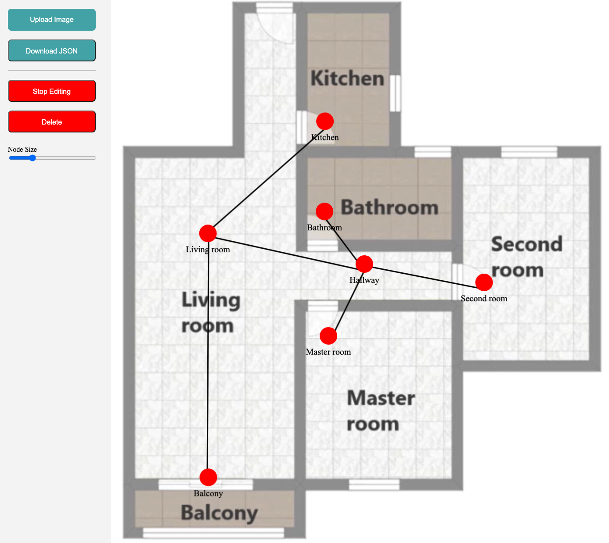

# CAD-Annotater

CAD-Annotater is a web-based tool designed for annotating CAD images. Users can upload images, add interactive nodes, connect nodes with edges, and export the annotated graph in JSON format. The tool is built with Flask and provides an intuitive interface for editing and annotating CAD drawings.




## Features

- Upload CAD images in SVG, PNG, JPG, or JPEG formats.
- Add, rename, delete, and resize nodes on the canvas.
- Connect nodes with edges to create a graph structure.
- Adjust node sizes dynamically using a slider.
- Export the graph structure as a JSON file for further processing or analysis.

## Getting Started

These instructions will help you get a copy of the project up and running on your local machine for development and testing purposes.

### Prerequisites

Ensure you have the following installed:

- [Python](https://www.python.org/downloads/)

### Installation

1. Clone the repository:

```bash
git clone https://github.com/yourusername/cad-annotater.git
cd cad-annotater
pip install -r requirements.txt